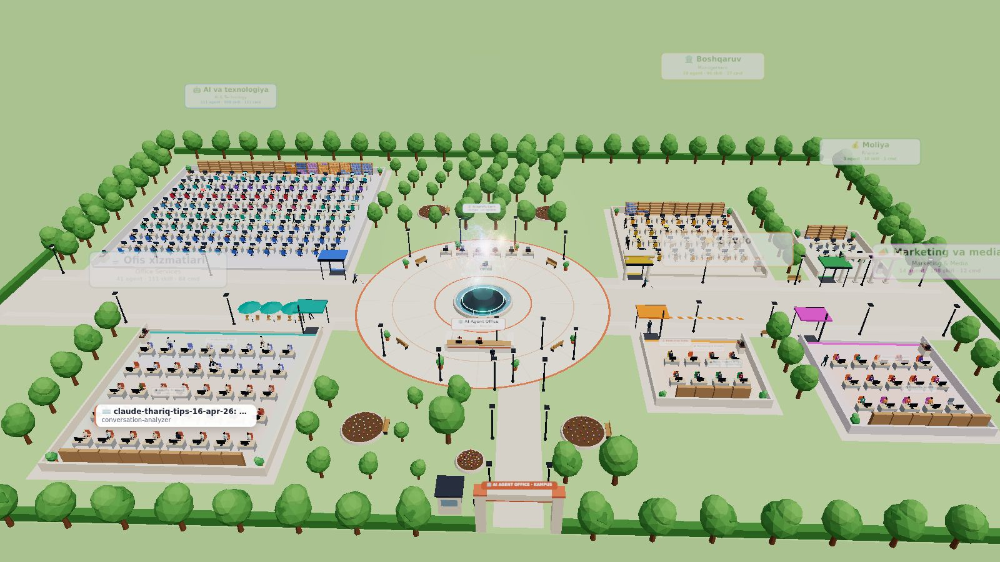
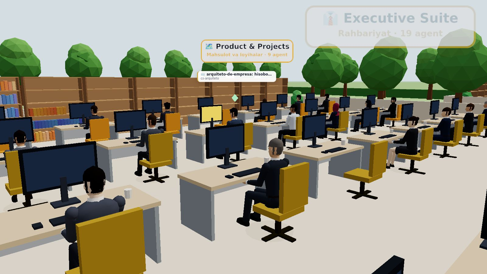
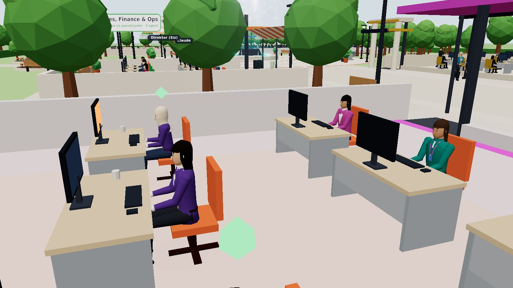
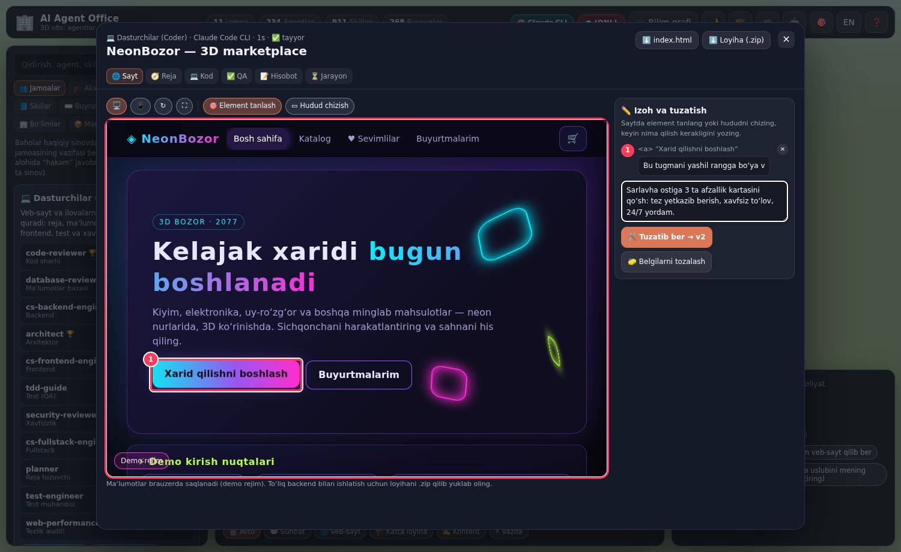
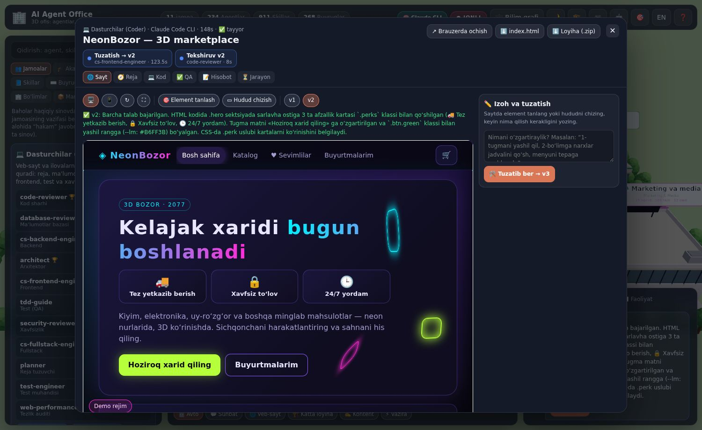
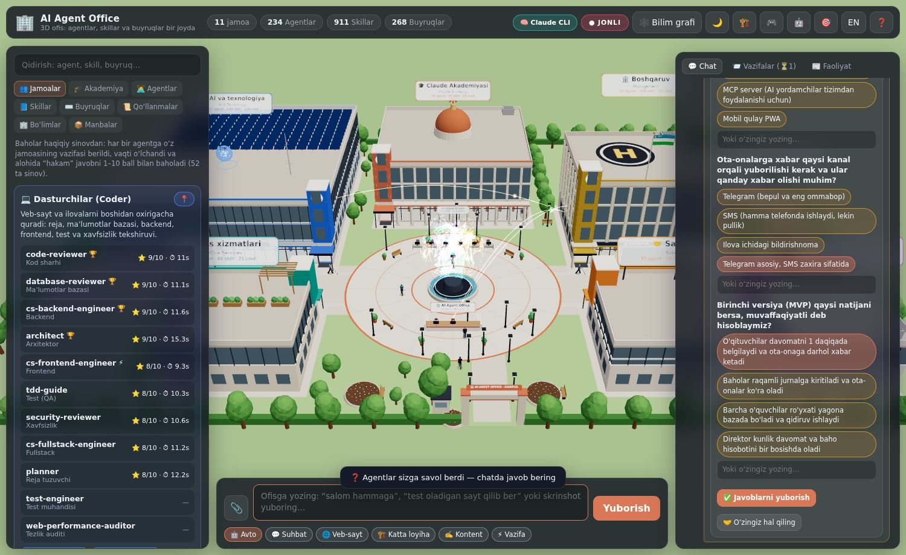
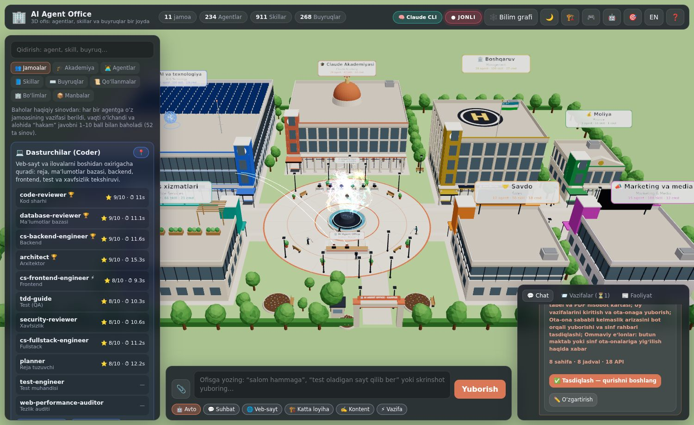
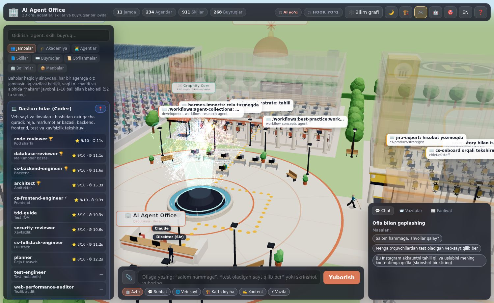
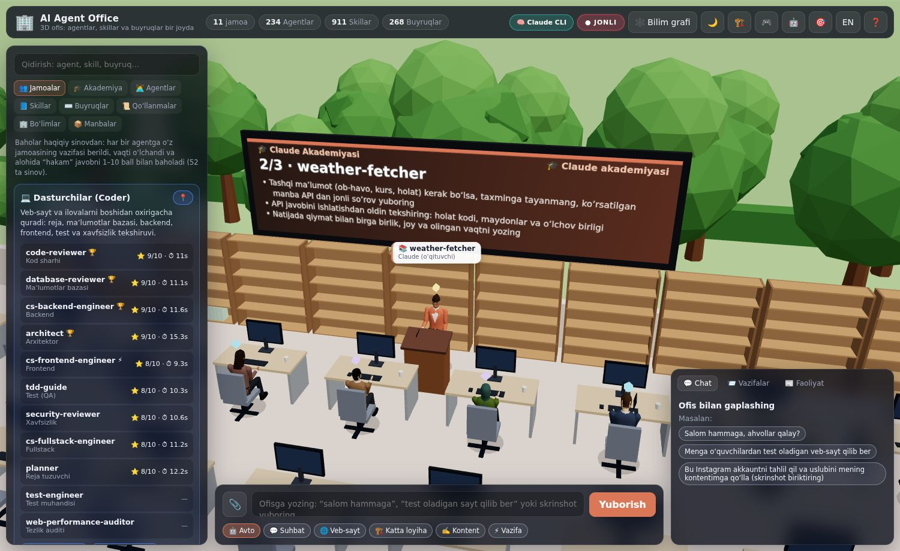

# 🏢 AI Agent Office

**Claude Code agentlari, skillari va buyruqlari yashaydigan va ishlaydigan 3D ofis.**
O‘n bitta ochiq manbali repozitoriydagi hamma narsa bitta joyga jamlangan, Graphify uslubidagi bilim grafiga bog‘langan va Three.js'da jonli **ofis kampusi** sifatida ko‘rsatiladi: har bir yo‘nalish uchun alohida bino, ichida esa haqiqiy odamlarga o‘xshagan xodimlar — direktordan farroshgacha.

> 🇬🇧 English version: [below](#-english).


| | |
|---|---|
| **7** bino | Boshqaruv · AI va texnologiya · Savdo · Marketing va media · Moliya · Ofis xizmatlari · 🎓 **Claude Akademiyasi** |
| **234** agent | har biri o‘z binosida, o‘z bo‘limi stolida o‘tiradi; lavozimiga mos kiyingan |
| **911** skill | bo‘lim javonlaridagi kitoblar (1 skill = 1 kitob) |
| **268** buyruq (slash command) | javonlardagi papkalar |
| **74** qo‘llanma | Claude Code best-practice, Microsoft “AI Agents for Beginners” darslari, “AI Agent Book” boblari, pi hujjatlari, 500 AI agent loyihalari |
| **14** bo‘lim | Rahbariyatdan Claude akademiyasigacha |
| **5 406** bog‘lanish | agent → skill, agent → agent, buyruq → agent … (EXTRACTED / INFERRED) |

## Nima qila oladi

- **3D kampus.** Bitta hududda 6 ta bino, har biri o‘z vazifasiga mos: 🏛️ **Boshqaruv** (tosh ustunlar, bayroq, vertolyot maydonchasi), 🤖 **AI va texnologiya** (LED chiziqlar, quyosh panellari, antenna, AI gologrammasi), 🤝 **Savdo** (billboard, soyabon), 📣 **Marketing va media** (jonli LED ekran, rangli qanotlar), 💰 **Moliya** (kolonnada va frontón), ☕ **Ofis xizmatlari** (tomdagi bog‘, kafe). O‘rtada favvorali maydon va Graphify Core, atrofda bog‘lar, chiroqlar, skameykalar, darvoza va qo‘riqchi budkasi. Uzoqdan binolar to‘liq ko‘rinadi; yaqinlashsangiz tomi va yuqori qavatlari yo‘qolib, ichidagi ish ko‘rinadi (🏗️ tugmasi — hamma binoning ichini birdan ko‘rish).
- **Haqiqiy odamlarga o‘xshagan xodimlar.** Har bir agent realistik proporsiyadagi odam: yuz (ko‘z, qosh, burun, lab, quloq), soch turmagi (qisqa, yon tomonga, uzun, tugun, dumcha, jingalak, kal, **hijob**, **do‘ppi**, furajka), soqol/mo‘ylov, tizzasi bukiladigan oyoqlar va tirsakli qo‘llar. Kiyim **lavozimga** qarab: direktor — kostyum va galstuk, yordamchi — blazer va planshet, dasturchi — xudi/naushnik, dizayner — golf, hisobchi — sviter va papka, savdo menejeri — kostyum va telefon, **farrosh** — ish kiyimi, fartuk va shvabra, **qo‘riqchi** — forma va furajka. Jami 12+ lavozim: direktor, yordamchi, operatsion menejer, AI strateg, savdo menejeri, marketing mutaxassisi, kontent yaratuvchi, dizayner, data tahlilchi, dasturchi, hisobchi, farrosh (+ qo‘riqchi, bosh koordinator Claude).
- **Jonli ofis hayoti.** Agentlar javondan kerakli skill kitobini olib o‘qiydi, stolida ishlaydi, grafda bog‘langan hamkasblari bilan maslahatlashadi, qahva ichgani boradi va markazdagi **Graphify Core**'ga savol beradi; farroshlar maydon va ofislarni tozalaydi, qo‘riqchi darvozada turadi va hududni aylanib chiqadi.
- **Jonli rejim.** Claude Code hooklari ulanganda ofis haqiqiy ishingizni ko‘rsatadi: siz yozgan so‘rov Boss ustida chiqadi, Claude (qabulxonada) asboblarni ishlatadi, Claude subagent chaqirsa — shu nomdagi agent stolida qizil belgi bilan ishlay boshlaydi, skill ishlatilsa — javondagi kitobi yonadi. Ofisda stoli yo‘q subagentlar (masalan `Explore`, `Plan`) mehmon sifatida kirib keladi.
- **Ofis bilan gaplashish va buyruq berish.** Pastdagi maydonga yozing (o‘zbekcha ham tushunadi) — ofis buyruqni o‘zi tushunib, kerakli jamoaga beradi:
  - 💬 **“Salom hammaga, ahvollar qalay?”** — bir nechta agent o‘z xarakterida javob beradi (chatda va 3D’da boshlari ustida).
  - 🌐 **“O‘quvchilardan test oladigan veb-sayt qilib ber”** — **Coder jamoasi** boshidan oxirigacha quradi: `planner` mukammal reja tuzadi → `database-reviewer` SQLite bazasi va demo maʼlumotlar → `cs-backend-engineer` Express API → `cs-frontend-engineer` to‘liq ishlaydigan sayt → `tdd-guide` test qiladi (jiddiy xato bo‘lsa frontend tuzatadi) → `office-manager` hisobot beradi. Tayyor bo‘lishi bilan sayt **darhol ochiladi**: jonli ko‘rinish (kompyuter/telefon), reja, baza, backend, frontend kodi, QA natijasi va `.zip` yuklab olish.
  - ✍️ **📎 Instagram/Telegram skrinshotlari + “akkauntni tahlil qil, uslubini mening kontentimga qo‘lla”** — **Kontent jamoasi**: `cs-content-creator` skrinshotlarni ko‘rib tahlil qiladi (auditoriya, ohang, ranglar palitrasi, kontent ustunlari, kuchli/zaif tomonlar) → `content-strategist` sizga moslab strategiya va **14 kunlik kontent reja** → `cs-growth-strategist` **5 ta tayyor post** → hisobot. Reja `.csv`, hisobot `.md` bo‘lib yuklanadi.
  - ⚡ **Boshqa har qanday vazifa** — eng mos jamoa: yetakchi reja tuzadi, mutaxassis bajaradi, boshqa agent tekshiradi.
- **Vazifa darhol bajariladi va brauzerda ochiladi.** “3D animatsiyali marketplace dizaynini qilib ber” kabi so‘rovlar endi **Coder jamoasiga** boradi: avval 2–4 ta aniqlashtiruvchi savol (variantlar bilan, “o‘zingiz hal qiling” ham mumkin), keyin reja, baza, backend va frontend. Birinchi versiya tayyor bo‘lishi bilan **ofis ichida ochiladi** (test davom etayotgan paytda ham), “↗ Brauzerda ochish” esa uni alohida oynada ko‘rsatadi. Xato bo‘lsa — tushunarli o‘zbekcha izoh va “🔁 Qayta urinish” (tugagan bosqichlar qayta bajarilmaydi). Sahifani yangilasangiz ham oxirgi 8 ta ish va chat saqlanib qoladi.
- **Belgilab tuzattirish.** Tayyor saytda “🎯 Element tanlash” bilan tugma/matnni bosing yoki “▭ Hudud chizish” bilan joyni chizib belgilang, har bir belgiga nima qilish kerakligini yozing (yoki umumiy izoh yozing) va **“🛠️ Tuzatib ber → v2”** ni bosing. Frontend agent aynan shu joylarni o‘zgartiradi, code-reviewer har bir talab bajarilganini tekshiradi. Saytdagi JavaScript xatolari avtomatik ushlanib, tuzatishga qo‘shiladi. Versiyalar (v1, v2, …) saqlanadi — istalganiga qaytish mumkin. “💻 Kod” bo‘limida barcha fayllar, “⏳ Jarayon”da har bir agent nima qilgani ko‘rinadi.
- **Katta loyihalar noldan (🏗️ Katta loyiha).** “Maktabni avtomatlashtirish kerak” desangiz, `cs-product-manager` xuddi Claude kabi 4–6 ta savol beradi (kimlar uchun, qaysi qismlar: veb-ilova, admin panel, Telegram bot, MCP server, eng muhim MVP natijasi…), `architect` to‘liq MVP rejasini tuzadi va **sizning tasdiqingizni** so‘raydi (o‘zgartirish kiritishingiz mumkin). Keyin jamoa quradi: SQLite baza → Express API → veb-ilova → **MCP server** (AI yordamchilar tizimdan foydalanishi uchun, `hermes`) → **Telegram bot** → QA → tuzatish → hisobot. Hammasi `.zip` bo‘lib yuklanadi, README bilan.
- **Boss simulyatsiyasi.** 🎮 tugmasi yoki Boss panelidagi “Bossni boshqarish”: **WASD / strelkalar** bilan yurasiz (Shift — tez), yerga bossangiz o‘sha joyga boradi, yo‘li to‘q sariq nuqtalar bilan ko‘rinadi (uzoq yo‘lda favvorani aylanib, xiyobon bo‘ylab yuradi). Agentni bossangiz — oldiga borib ishini tekshiradi. **🕵️ Avto-tekshiruv** yoqilsa, Boss o‘zi binodan binoga, stoldan stolga yurib agentlar bilan suhbatlashadi va ishini baholaydi (haqiqiy sinov bali, akademiyadagi darajasi, skillari, oxirgi xatolari). Kamchiligi borlarni **Claude Akademiyasiga yuboradi**. **🧪 Haqiqiy imtihon** — Boss agentning sohasidan amaliy savol beradi, agent o‘z xarakterida javob beradi, qat’iy hakam 1–10 baholaydi (kuchli tomonlari va kamchiliklari bilan); 8 dan past bo‘lsa — akademiyaga.
- **🎓 Claude Akademiyasi.** Kampus markazidagi mis gumbazli bino: 24 o‘rinli auditoriya, katta ekran va minbarda **Claude — o‘qituvchi**. Har bir dars bitta bo‘lim uchun: Boss tanlaganlar birinchi, keyin eng kam o‘qiganlar — shu tarzda **barcha agentlar** navbat bilan o‘qiydi. Dars: yig‘ilish → 3 ta skill bo‘yicha maʼruza (ekranda) → imtihon → tabriklash. AI ulangan bo‘lsa Claude o‘qituvchi sifatida haqiqiy **dars konspektini** yozadi (9 ta amaliy qoida). O‘rganilgan skillar va konspekt agentning keyingi **har bir vazifasiga** qo‘shiladi, darajasi (XP) oshadi. “🎓 Akademiya” bo‘limida hozirgi dars, navbat, eng yaxshi o‘quvchilar, konspektlar va kurslar (Microsoft AI Agents for Beginners, AI Agent Book) ko‘rinadi.
- **O‘zbek tilida.** Interfeys o‘zbekcha bo‘lsa, barcha agentlar o‘zbekcha (lotin, oʻ/gʻ) javob beradi: savollar, reja, hisobot, sayt matnlari ham.
- **Jamoalar va haqiqiy sinov.** Agentlar ish turiga qarab 11 ta jamoaga ajratilgan (Coder, Kontent, Dizayn, Marketing, Tahlil, Biznes, Taʼlim, Xavfsizlik, DevOps, Mahsulot, Ofis). Har bir agent o‘z jamoasining vazifasi bilan **haqiqatan sinovdan o‘tkazilgan**: vaqti o‘lchangan va alohida “hakam” javobni 1–10 ball bilan baholagan. “👥 Jamoalar” bo‘limida 🏆 eng zo‘r va ⚡ eng tez agentlar ko‘rinadi (`npm run benchmark`).
- **Agent portreti.** Istalgan odamni bosing — inspektorda o‘sha odamning o‘zi yuqori sifatda chiqadi: to‘liq yuz (ko‘z pirpiratadi, gapirganda og‘zi qimirlaydi) va butun tana, lavozimi va binosi. Aylantirish mumkin, “🙂 Yuz” va “🧍 To‘liq bo‘y” ko‘rinishlari bor.
- **Ishga olish.** Istalgan agent, skill yoki buyruqni bir tugma bilan `.claude/` papkangizga o‘rnating (agent o‘zi e’lon qilgan skillari bilan birga).
- **Bilim grafi.** 1386 tugun va 5087 bog‘lanishdan iborat Graphify uslubidagi graf: bo‘limlar bo‘yicha jamoalar, “eng bog‘langan tugunlar”, qidiruv, EXTRACTED/INFERRED filtrlari.
- **Bitta joy.** `library/` papkasida barcha agentlar, skillar, buyruqlar va qo‘llanmalar asl holida, litsenziyalari bilan; `library/CATALOG.md` va `library/departments/*.md` — to‘liq katalog.
- Kun/tun rejimi, o‘zbek/ingliz interfeysi, telefonda ham ishlaydi.

| 🏗️ Binolar ichi: agentlar o‘z binosida ishlamoqda | 🧍 Agent portreti: yuz va butun tana, lavozim |
|---|---|
|  |  |
| 👔 Boshqaruv binosi: kostyumdagi rahbarlar | 📣 Marketing va media: blazer, hijob, lanyard |
|  |  |
| 👥 Jamoalar (haqiqiy sinov baholari) va “Salom hammaga” suhbati | 🌙 Tungi kampus: derazalar va chiroqlar yonadi |
|  |  |
| 🌐 **“O‘quvchilardan test oladigan veb-sayt qilib ber”** — Coder jamoasi qurgan sayt ofisda darhol ochiladi | ✅ O‘sha sayt ishlaydi: kod `DEMO1` → ism → test → natija va javoblar tahlili |
|  |  |
| ✍️ **Instagram skrinshoti + “uslubini mening kontentimga qo‘lla”** — tahlil | ✍️ Tayyor postlar (matematika repetitori uchun) |
|  |  |
| ⚡ Boshqa vazifa: “narx strategiyasi tuz” → Biznes jamoasi (reja → bajarish → tekshiruv) | 📱 Telefonda |
|  |  |
| 🕸️ Bilim grafi | |
|  | |

**Yangi:** belgilab tuzattirish, katta loyihalar, Boss va Claude Akademiyasi

| ✏️ “3d animatsion market placeni dizayni qilib ber” — saytdagi tugma belgilandi va nima qilish kerakligi yozildi | ✅ v2: aytilganidek — yashil “Hoziroq xarid qiling” tugmasi va 3 ta afzallik kartasi (code-reviewer har bir talabni tekshirgan) |
|---|---|
|  |  |
| 🏗️ “Maktabimizni avtomatlashtirish kerak…” — agentlar Claude kabi savol beradi (taxminlari oldindan belgilangan) | 📋 MVP reja: veb-ilova, API, MCP server, Telegram bot — tasdiqlang yoki o‘zgartiring |
|  |  |
| 🎮 Bossni boshqarish: yo‘li to‘q sariq nuqtalar bilan ko‘rinadi | 🎓 Claude Akademiyasi: Claude dars beradi, ekranda konspekt |
|  |  |

## Tez boshlash

Node.js **20.11+** kerak.

```bash
git clone https://github.com/bahriddin2005/ai-agent-office.git
cd ai-agent-office
npm install
npm run dev          # http://localhost:3333 — ofis + server (jonli rejim)
```

Yoki bitta port bilan: `npm start` → **http://localhost:3334** (build qiladi va server UI'ni ham beradi).

Server ishlamasa ham ofis simulyatsiya rejimida ishlaydi. **GitHub Pages:** repozitoriyda *Settings → Pages → Source: GitHub Actions* ni yoqing — `main` ga har push'da ofis avtomatik joylanadi (`.github/workflows/pages.yml`).

### Jonli rejim — Claude Code'ni ofisga ulash

```bash
npm run hooks:install                      # ~/.claude/settings.json ga (barcha loyihalar)
npm run hooks:install -- --project ../app  # faqat bitta loyihaga
npm run hooks:install -- --remove          # olib tashlash
```

Keyin ofisni ishga tushiring (`npm run dev`) va Claude Code'dan odatdagidek foydalaning. Yuqori o‘ng burchakda **● JONLI** belgisi yonadi.

### Agentlarga buyruq berish — AI qayerdan keladi

Pastdagi maydonga yozing, kerak bo‘lsa 📎 bilan skrinshot biriktiring (yoki rasmni joylashtiring/tashlang) va **Yuborish** ni bosing. Rejim avtomatik tanlanadi; xohlasangiz “💬 Suhbat / 🌐 Veb-sayt / 🏗️ Katta loyiha / ✍️ Kontent / ⚡ Vazifa” ni o‘zingiz tanlang. Yuqoridagi **🧠** belgisi agentlar qaysi AI bilan ishlayotganini ko‘rsatadi:

| Qayerda ochilgan | Agentlar nima bilan ishlaydi |
|---|---|
| `npm run dev` / `npm start` (kompyuteringizda) | Kompyuteringizdagi **Claude Code CLI** (`claude -p`, agentning o‘z ko‘rsatmalari system prompt sifatida). Yaratilgan saytlar `workspaces/<id>/` ga saqlanadi va alohida xavfsiz (sandbox) sahifada ochiladi. |
| claude.ai ichidagi artifact | **Claude hisobingiz** (`sample` imkoniyati). Birinchi so‘rovda ruxsat so‘raladi; skrinshotlar ham yuboriladi. |
| GitHub Pages yoki boshqa statik joy | AI yo‘q — ofis o‘z-o‘zidan “yashaydi”, buyruqlar bajarilmaydi va bu aniq aytiladi. |

Model darajalari: suhbat — tezkor model, reja/baza/backend/tahlil — standart, frontend — eng kuchli. `office.config.json` da `"models": {"quick": "haiku", "default": "sonnet", "complex": "opus"}` bilan o‘zgartirish mumkin.

### Jamoalar va sinov natijalari

`npm run benchmark` har bir jamoa aʼzosiga o‘z jamoasining vazifasini beradi (masalan, Coder: “test oladigan sayt uchun texnik reja”, Kontent: “7 kunlik Instagram reja”), vaqtini o‘lchaydi va alohida hakam-model javobni baholaydi. Oxirgi sinov (52 ta haqiqiy chaqiruv):

| Jamoa | 🏆 Eng yuqori baho | ⚡ Eng tez | Jamoa o‘rtachasi |
|---|---|---|---|
| 💻 Coder | database-reviewer, cs-backend-engineer, architect, code-reviewer — 9/10 | cs-frontend-engineer — 9.3 s | 8.4 |
| ✍️ Kontent | Content Strategist, cs-content-creator, cs-growth-strategist — 8/10 | cs-growth-strategist — 13.0 s | 7.7 |
| 🎨 Dizayn | cs-ux-researcher — 9/10 | presentation-vibe-coding — 12.8 s | 8.3 |
| 📣 Marketing | cs-demand-gen-specialist, Growth Marketer, seo-specialist — 8/10 | Growth Marketer — 13.2 s | 7.8 |
| 🔬 Tahlil | cs-deep-research, cs-product-analyst, graphify-librarian, cs-dossier — 7/10 | cs-product-analyst — 13.1 s | 6.8 |
| 💼 Biznes | cs-ceo-advisor, cs-financial-analyst — 9/10 | cs-bizops-orchestrator — 15.8 s | 8.4 |
| 🎓 Taʼlim | cs-deep-learning-tutor, cs-claude-coach — 8/10 | cs-deep-learning-tutor — 8.6 s | 7.7 |
| 🛡️ Xavfsizlik | security-reviewer — 8/10 | security-reviewer — 10.8 s | 6.5 |
| ☁️ DevOps | DevOps Engineer, network-architect, homelab-architect — 9/10 | build-error-resolver — 9.7 s | 8.8 |
| 🗺️ Mahsulot | cs-project-manager — 9/10 | cs-project-manager — 11.7 s | 8.0 |
| 🏢 Ofis | office-manager — 8/10 | hermes — 8.9 s | 6.0 |

Baholar model hakamining fikri — aniq o‘lchov emas, lekin qaysi agentni qaysi ishga qo‘yishni tanlashda yordam beradi. To‘liq javoblar `public/data/benchmarks.json` da va inspektorda (“🧪 Sinov”).

### Agentlarni “ishga olish”

```bash
npm run hire -- agent:ecc:code-reviewer                 # id bo‘yicha
npm run hire -- cs-backend-engineer vue-patterns        # nom bo‘yicha
npm run hire -- --dept security --type agent            # butun bo‘lim
npm run hire -- --source hermes --type skill --list     # faqat ko‘rish
npm run hire -- agent:ecc:planner --scope user          # ~/.claude ga
npm run hire -- agent:ecc:planner --project ../myapp    # boshqa loyihaga
```

Agent o‘zi e’lon qilgan skillari bilan birga o‘rnatiladi. `.sources/` mavjud bo‘lsa (`npm run sync`), skillar skript va reference fayllari bilan to‘liq nusxalanadi.

### Kutubxonani yangilash

```bash
npm run sync            # 11 ta repozitoriyni .sources/ ga klonlaydi yoki yangilaydi (kattalari sparse)
npm run build:library   # library/, public/data/registry.json va graph.json ni qayta quradi
```

To‘liq Graphify grafini ham qurish mumkin: `uv tool install graphifyy && graphify install`, keyin Claude Code'da `/graphify library/`.

## Kampus binolari

| Bino / Building | Ichidagi bo‘limlar | Agentlar | Skillar | Buyruqlar |
|---|---|---|---|---|
| 🏛️ **Boshqaruv** — Management | Rahbariyat, Mahsulot va loyihalar | 28 | 100 | 27 |
| 🤖 **AI va texnologiya** — AI & Technology | Muhandislik, dasturlash tillari, frontend, DevOps, xavfsizlik, AI, data | 131 | 530 | 126 |
| 🤝 **Savdo** — Sales | savdo/CRM agentlari (marketing, biznes, rahbariyatdan) | 12 | 50 | 18 |
| 📣 **Marketing va media** — Marketing & Media | Marketing va o‘sish, Ijodiy studiya | 15 | 108 | 12 |
| 💰 **Moliya** — Finance | CFO, moliya, hisob-kitob agentlari | 3 | 10 | 1 |
| ☕ **Ofis xizmatlari** — Office Services | Samaradorlik markazi | 16 | 66 | 21 |
| 🎓 **Claude Akademiyasi** — Claude Academy | Claude akademiyasi (best-practice, kurslar); 24 o‘rinli auditoriya, o‘qituvchi Claude | 29 | 47 | 63 |

Agent qaysi binoda ishlashi bo‘limidan va nomidan aniqlanadi (`buildingOf` — `src/world/layout.ts`), lavozimi va kiyimi esa `roleOf` (`src/sim/actors.ts`) va `lookFor` (`src/world/human.ts`) orqali.

## Bo‘limlar

| Bo‘lim / Department | Agentlar | Skillar | Buyruqlar |
|---|---|---|---|
| 👔 **Executive Suite** — Rahbariyat | 21 | 62 | 2 |
| 🛠️ **Engineering Core** — Muhandislik markazi | 43 | 155 | 52 |
| 🧩 **Languages & Build** — Dasturlash tillari | 25 | 52 | 16 |
| 🎨 **Frontend & Design** — Frontend va dizayn | 8 | 68 | 19 |
| ☁️ **DevOps & Cloud** — DevOps va bulut | 8 | 40 | 3 |
| 🛡️ **Security & Compliance** — Xavfsizlik va muvofiqlik | 13 | 60 | 9 |
| 🧠 **AI & ML Lab** — Sunʼiy intellekt laboratoriyasi | 12 | 88 | 5 |
| 🔬 **Data & Research** — Maʼlumot va tadqiqot | 22 | 67 | 22 |
| 🗺️ **Product & Projects** — Mahsulot va loyihalar | 9 | 42 | 25 |
| 📣 **Marketing & Growth** — Marketing va o‘sish | 16 | 65 | 13 |
| 💼 **Sales, Finance & Ops** — Savdo, moliya va operatsiyalar | 9 | 56 | 18 |
| 🎬 **Creative Studio** — Ijodiy studiya | 3 | 43 | 0 |
| ⚡ **Productivity Hub** — Samaradorlik markazi | 16 | 66 | 21 |
| 🎓 **Claude Academy** — Claude akademiyasi | 29 | 47 | 63 |

Markaziy maydonda: **Claude** (bosh koordinator, qabulxonada), **office-manager** (Claude-Office'dan), **Direktor (Siz)**, **graphify-librarian**, favvora va Graphify Core gologrammasi; mehmon agentlar uchun stollar. Kampusda yana 3 ta farrosh va 1 qo‘riqchi ishlaydi.

## Manbalar

| Manba / Source | Litsenziya | Agentlar | Skillar | Buyruqlar | Qo‘llanmalar | Ofisdagi roli |
|---|---|---|---|---|---|---|
| [Claude Code Best Practice](https://github.com/shanraisshan/claude-code-best-practice) | MIT | 20 | 6 | 14 | 20 | Claude akademiyasi: best-practice, workflow, namuna agentlar |
| [Claude Skills](https://github.com/alirezarezvani/claude-skills) | MIT | 109 | 373 | 142 | 1 | Eng katta skill va persona kutubxonasi: muhandislik, mahsulot, marketing, C-level, compliance, moliya |
| [Claude Office](https://github.com/W17ant/Claude-Office) | MIT | 1 | 0 | 0 | 1 | Asl g‘oya: Claude Code hook → server → jonli ofis; office-manager persona |
| [Graphify](https://github.com/Graphify-Labs/graphify) | Apache-2.0 | 1 | 1 | 0 | 1 | Hamma narsani bitta bilim grafiga jamlash; graphify-librarian |
| [Hermes Agent](https://github.com/NousResearch/hermes-agent) | MIT | 1 | 211 | 0 | 1 | O‘z-o‘zini yaxshilaydigan agent va katta skill katalogi |
| [ECC](https://github.com/affaan-m/ECC) | MIT | 73 | 292 | 97 | 1 | Til bo‘yicha reviewerlar, build resolverlar, buyruqlar va yuzlab skillar |
| [AI Agents for Beginners](https://github.com/microsoft/ai-agents-for-beginners) | MIT | 0 | 0 | 0 | 20 | Microsoft’ning AI agentlar kursi (darslar) — Claude Akademiyasi kutubxonasida |
| [AI Agent Book](https://github.com/bojieli/ai-agent-book) | Apache-2.0 | 0 | 0 | 0 | 12 | AI agentlar haqidagi kitob boblari — Claude Akademiyasi kutubxonasida |
| [Agent Skills](https://github.com/addyosmani/agent-skills) | MIT | 4 | 25 | 9 | 1 | Muhandislik skillari (TDD, xavfsizlik, reja, debugging, performance); test-engineer, security-auditor, web-performance-auditor agentlari |
| [500 AI Agents Projects](https://github.com/ashishpatel26/500-AI-Agents-Projects) | MIT | 21 | 0 | 0 | 5 | Tayyor agentlar (yordam xizmati, rezyume tahlili, veb-tadqiqot, email, uchrashuv qaydlari…) va sohalar bo‘yicha foydalanish holatlari (CrewAI, AutoGen, Agno, LangGraph) |
| [pi](https://github.com/earendil-works/pi) | MIT | 4 | 3 | 6 | 11 | pi coding agent: subagentlar (scout, planner, reviewer, worker), prompt buyruqlari, skillar va hujjatlar |

Har bir fayl o‘z muallifi va litsenziyasini saqlaydi — qarang: [THIRD_PARTY_NOTICES.md](THIRD_PARTY_NOTICES.md) va `library/LICENSES/`.

## Qanday ishlaydi

```
Claude Code ──hook (office-hook.mjs)──▶ server :3334 ──WebSocket──▶ 3D ofis (Three.js)
                                           │  ▲
                            claude -p ◀────┘  └── vazifa / ishga olish (UI)
                                           │
                     library/ + registry.json + graph.json  ◀── build-library.mjs ◀── .sources/ (11 repo)
```

| Papka | Mazmuni |
|---|---|
| `src/world/` | Sahna: kampus rejasi va binolar ro‘yxati (`layout.ts`), binolar, maydon, bog‘lar (`campus.ts`), mebel va javonlar (`office.ts`), odam modeli, kiyimlar, lavozimlar va harakatlar (`human.ts`), instanced olomon (`people.ts`), portret (`avatar.ts`), effektlar, yorliqlar |
| `src/sim/` | Agentlar holat mashinasi (`actors.ts`), rejissyor: avto-hayot + jonli hodisalar (`director.ts`), Claude Akademiyasi darslari (`academy.ts`), Boss tekshiruvlari va boshqaruvi (`boss.ts`) |
| `src/ai/` | AI qayerdan keladi (`engine.ts`), jamoalar: suhbat, sayt, katta loyiha, kontent, vazifa, tuzatish versiyalari (`crews.ts`), Boss imtihoni va dars konspekti (`exam.ts`) |
| `src/ui/` | Panellar (`hud.ts`), natija oynasi: sayt ko‘rinishi, belgilash, versiyalar, kod (`results.ts`), bilim grafi (`graphView.ts`), markdown |
| `src/router.ts` | Vazifani eng mos agentga yo‘naltirish (TF‑IDF, o‘zbekcha sinonimlar bilan) |
| `server/` | Express + WebSocket: hooklar, vazifalar (`dispatch.mjs`), ishga olish |
| `scripts/` | `sync-sources`, `build-library` (katalog + graf + 3D joylashuv), `hire`, `install-hooks` |
| `hooks/office-hook.mjs` | Claude Code hook → ofis serveri |
| `library/` | Hamma agent, skill, buyruq va qo‘llanmalar bitta joyda |

### URL parametrlari

`?night` — tungi rejim · `?speed=3` — simulyatsiyani tezlashtirish · `?nobloom` — kuchsiz kompyuterlar uchun · `?offline` — serverga ulanmaslik.

## Xavfsizlik

- Server faqat `127.0.0.1` da tinglaydi; `Host` va `Origin` sarlavhalari tekshiriladi (DNS rebinding va boshqa saytlardan so‘rovlar bloklanadi).
- Hooklar va UI `~/.ai-agent-office/token` (0600) dagi token bilan autentifikatsiya qilinadi.
- Agent chaqiruvlari bo‘sh vaqtinchalik papkada, asboblarsiz ishlaydi (skrinshot uchun faqat o‘qish); yaratilgan saytlar `workspaces/` dan CSP sandbox bilan beriladi, ofis ichidagi ko‘rinish esa `sandbox` iframe'da.

---

## 🇬🇧 English

**A 3D office where Claude Code agents, skills and commands live and work.** Everything from eleven open-source repos — [claude-code-best-practice](https://github.com/shanraisshan/claude-code-best-practice), [claude-skills](https://github.com/alirezarezvani/claude-skills), [Claude-Office](https://github.com/W17ant/Claude-Office), [graphify](https://github.com/Graphify-Labs/graphify), [hermes-agent](https://github.com/NousResearch/hermes-agent), [ECC](https://github.com/affaan-m/ECC), [ai-agents-for-beginners](https://github.com/microsoft/ai-agents-for-beginners), [ai-agent-book](https://github.com/bojieli/ai-agent-book), [agent-skills](https://github.com/addyosmani/agent-skills), [500-AI-Agents-Projects](https://github.com/ashishpatel26/500-AI-Agents-Projects) and [pi](https://github.com/earendil-works/pi) — is gathered into `library/`, linked into a Graphify-style knowledge graph and rendered as a living Three.js office.

- **A campus of seven buildings**, one per line of work plus Claude Academy, in one architectural family: 🏛️ Management (stone piers, flag, helipad), 🤖 AI & Technology (LED bands, solar roof, dish, AI hologram), 🤝 Sales (billboard, awning), 📣 Marketing & Media (live LED screen, colour fins), 💰 Finance (colonnade and pediment), ☕ Office Services (roof garden, café) — around a plaza with a fountain and the Graphify Core, gardens, lamps and a gated entrance. From afar you see whole buildings; zoom in and roofs and upper floors fade away to show the work inside (🏗️ shows every interior at once).
- **People who look like people:** realistic proportions, faces, hair (including hijab and doppi), beards, knees and elbows, and clothes by job — director in a suit and tie, assistant with a tablet, developer in a hoodie with headphones, accountant in a sweater with a folder, cleaner with an apron and a mop, guard in uniform. 12+ roles from director to cleaner; cleaners mop the plaza and offices and a guard patrols the gate.
- **234 agents** sit at desks in their building by department; **911 skills** and **268 commands** are books on each building's shelves; **74 guides** include Microsoft's AI Agents for Beginners lessons and the AI Agent Book chapters.
- **Ambient life:** agents fetch skill books, work, consult colleagues they are linked to in the graph, grab coffee and query the central **Graphify Core**.
- **Live mode:** `npm run hooks:install` wires Claude Code hooks to the office. Your prompts, Claude's tool calls, subagents (matched to their desks, or arriving as visitors) and skills (glowing books) show up in real time.
- **Talk and give work (English or Uzbek):** “hi everyone” gets in-character replies from several agents; “build me a quiz website” sends the **Coder team** through plan → SQLite database → Express backend → complete frontend → QA (and a fix pass) → report, then opens the finished site with its plan, code and a .zip; screenshots of an Instagram/Telegram account plus “analyse and apply the style to my content” sends the **Content team** through analysis → strategy and 14-day plan → 5 ready posts. Any other task goes to the best team: the lead plans, a specialist delivers, a colleague reviews.
- **Work opens right away:** design / 3D / marketplace requests go to the Coder team, which asks 2–4 clarifying questions, plans and builds, and opens the first version inside the office as soon as it exists (tests keep running). Errors come with a plain explanation and a Retry that keeps finished steps; the last 8 runs and the chat survive a reload.
- **Mark it, get it fixed:** pick an element or draw an area on the live preview, write what to change, press “Fix → v2”. The frontend agent changes exactly that, a reviewer checks each request, JavaScript errors from the preview are reported automatically, and every version is kept (restore any). The Code tab lists every file; the Progress tab shows what each agent did.
- **Big projects from zero:** “automate a school” starts a product interview (4–6 questions: users, parts — web app, admin, Telegram bot, MCP server — and the MVP goal), a full MVP plan you approve or change, then database → API → web app → **MCP server** → **Telegram bot** → QA → fixes → report, downloadable as a .zip with a README.
- **Boss simulation:** 🎮 lets you walk the Boss (WASD / arrows, Shift to run, click the ground to walk there along the boulevard; the route is drawn as a trail of orange dots), click an agent to go check their work. **Patrol** makes the Boss walk desk to desk on its own, talk to agents, score them (benchmark, academy level, skills, recent errors) and send those who need it to Claude Academy. **Real exam**: the Boss asks a practical question from the agent's field, the agent answers in character, a strict examiner scores 1–10 with strengths and gaps; below 8 means class.
- **🎓 Claude Academy:** a copper-domed building in the middle of the campus with a 24-seat lecture hall, a big screen and Claude teaching at the lectern. Each class is one department — the Boss's picks first, then whoever studied least, so every agent gets trained. Gather → lecture on 3 skills → exam → graduation; with an AI connected, Claude as the teacher writes real lesson notes (9 practical rules). Learned skills and notes are added to the agent's instructions for every later task and raise its level.
- **Uzbek:** with the Uzbek UI every agent answers in Uzbek (Latin script) — questions, plans, reports and site copy.
- **Real agents:** every step is a real call with that agent's own instructions — through the Claude Code CLI when the local server runs, or through the viewer's own Claude when the office is opened in claude.ai.
- **Teams and a real benchmark:** 11 task teams; `npm run benchmark` gave every member its team's task, timed it and had a judge model score it (52 runs). The Teams tab marks 🏆 best and ⚡ fastest agents.
- **Portraits:** click anyone for the same person in high detail — a rotatable face (blinking, talking) and full body, with their role and building.
- **Hire:** install any agent/skill/command into `.claude/` from the inspector or with `npm run hire -- <id>`.
- **Knowledge graph:** 1,512 nodes / 5,406 edges with EXTRACTED vs INFERRED edges, communities by department and "god nodes".

```bash
npm install
npm run dev              # http://localhost:3333
npm start                # build + serve on http://localhost:3334
npm run hooks:install    # connect Claude Code (live mode)
npm run hire -- --list --type agent
npm run sync && npm run build:library   # refresh from upstream
```

Office code is MIT. Library files keep their original licenses (MIT, and Apache-2.0 for Graphify and AI Agent Book) — see [THIRD_PARTY_NOTICES.md](THIRD_PARTY_NOTICES.md).
