# 🏢 AI Agent Office

**Claude Code agentlari, skillari va buyruqlari yashaydigan va ishlaydigan 3D ofis.**
Oltita ochiq manbali repozitoriydagi hamma narsa bitta joyga jamlangan, Graphify uslubidagi bilim grafiga bog‘langan va Three.js'da jonli ofis sifatida ko‘rsatiladi.

> 🇬🇧 English version: [below](#-english).

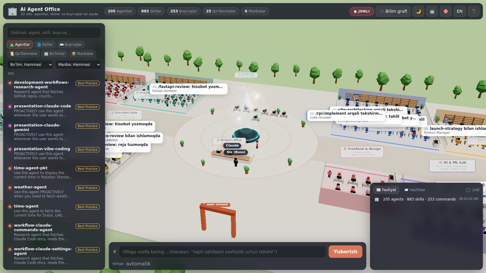

| | |
|---|---|
| **205** agent | har biri o‘z bo‘limida, o‘z stolida o‘tiradi |
| **883** skill | bo‘lim javonlaridagi kitoblar (1 skill = 1 kitob) |
| **253** buyruq (slash command) | javonlardagi papkalar |
| **25** qo‘llanma | Claude Code best-practice va har bir manbaning README'si |
| **14** bo‘lim | Rahbariyatdan Claude akademiyasigacha |
| **5 087** bog‘lanish | agent → skill, agent → agent, buyruq → agent … (EXTRACTED / INFERRED) |

## Nima qila oladi

- **3D ofis.** Har bir agent o‘z bo‘limida stolda o‘tiradi. Agentlar javondan kerakli skill kitobini olib o‘qiydi, stolida ishlaydi, grafda bog‘langan hamkasblari bilan maslahatlashadi, qahva ichgani boradi va markazdagi **Graphify Core**'ga savol beradi.
- **Jonli rejim.** Claude Code hooklari ulanganda ofis haqiqiy ishingizni ko‘rsatadi: siz yozgan so‘rov Boss ustida chiqadi, Claude (qabulxonada) asboblarni ishlatadi, Claude subagent chaqirsa — shu nomdagi agent stolida qizil belgi bilan ishlay boshlaydi, skill ishlatilsa — javondagi kitobi yonadi. Ofisda stoli yo‘q subagentlar (masalan `Explore`, `Plan`) mehmon sifatida kirib keladi.
- **Ofis bilan gaplashish va buyruq berish.** Pastdagi maydonga yozing (o‘zbekcha ham tushunadi) — ofis buyruqni o‘zi tushunib, kerakli jamoaga beradi:
  - 💬 **“Salom hammaga, ahvollar qalay?”** — bir nechta agent o‘z xarakterida javob beradi (chatda va 3D’da boshlari ustida).
  - 🌐 **“O‘quvchilardan test oladigan veb-sayt qilib ber”** — **Coder jamoasi** boshidan oxirigacha quradi: `planner` mukammal reja tuzadi → `database-reviewer` SQLite bazasi va demo maʼlumotlar → `cs-backend-engineer` Express API → `cs-frontend-engineer` to‘liq ishlaydigan sayt → `tdd-guide` test qiladi (jiddiy xato bo‘lsa frontend tuzatadi) → `office-manager` hisobot beradi. Tayyor bo‘lishi bilan sayt **darhol ochiladi**: jonli ko‘rinish (kompyuter/telefon), reja, baza, backend, frontend kodi, QA natijasi va `.zip` yuklab olish.
  - ✍️ **📎 Instagram/Telegram skrinshotlari + “akkauntni tahlil qil, uslubini mening kontentimga qo‘lla”** — **Kontent jamoasi**: `cs-content-creator` skrinshotlarni ko‘rib tahlil qiladi (auditoriya, ohang, ranglar palitrasi, kontent ustunlari, kuchli/zaif tomonlar) → `content-strategist` sizga moslab strategiya va **14 kunlik kontent reja** → `cs-growth-strategist` **5 ta tayyor post** → hisobot. Reja `.csv`, hisobot `.md` bo‘lib yuklanadi.
  - ⚡ **Boshqa har qanday vazifa** — eng mos jamoa: yetakchi reja tuzadi, mutaxassis bajaradi, boshqa agent tekshiradi.
- **Jamoalar va haqiqiy sinov.** 205 agent ish turiga qarab 11 ta jamoaga ajratilgan (Coder, Kontent, Dizayn, Marketing, Tahlil, Biznes, Taʼlim, Xavfsizlik, DevOps, Mahsulot, Ofis). Har bir agent o‘z jamoasining vazifasi bilan **haqiqatan sinovdan o‘tkazilgan**: vaqti o‘lchangan va alohida “hakam” javobni 1–10 ball bilan baholagan. “👥 Jamoalar” bo‘limida 🏆 eng zo‘r va ⚡ eng tez agentlar ko‘rinadi (`npm run benchmark`).
- **Agent portreti.** Istalgan odamni bosing — inspektorda uning 3D portreti chiqadi: to‘liq yuz (ko‘z, qosh, burun, og‘iz, soch turmagi) va butun tana, bo‘limiga mos aksessuar (naushnik, ko‘zoynak, galstuk, beret, VR-vizor, akademik qalpoq). Aylantirish mumkin, “🙂 Yuz” va “🧍 To‘liq bo‘y” ko‘rinishlari bor.
- **Ishga olish.** Istalgan agent, skill yoki buyruqni bir tugma bilan `.claude/` papkangizga o‘rnating (agent o‘zi e’lon qilgan skillari bilan birga).
- **Bilim grafi.** 1386 tugun va 5087 bog‘lanishdan iborat Graphify uslubidagi graf: bo‘limlar bo‘yicha jamoalar, “eng bog‘langan tugunlar”, qidiruv, EXTRACTED/INFERRED filtrlari.
- **Bitta joy.** `library/` papkasida barcha agentlar, skillar, buyruqlar va qo‘llanmalar asl holida, litsenziyalari bilan; `library/CATALOG.md` va `library/departments/*.md` — to‘liq katalog.
- Kun/tun rejimi, o‘zbek/ingliz interfeysi, telefonda ham ishlaydi.

| 👥 Jamoalar (haqiqiy sinov baholari) va “Salom hammaga” suhbati | 🧍 Agent portreti: yuz va butun tana |
|---|---|
| 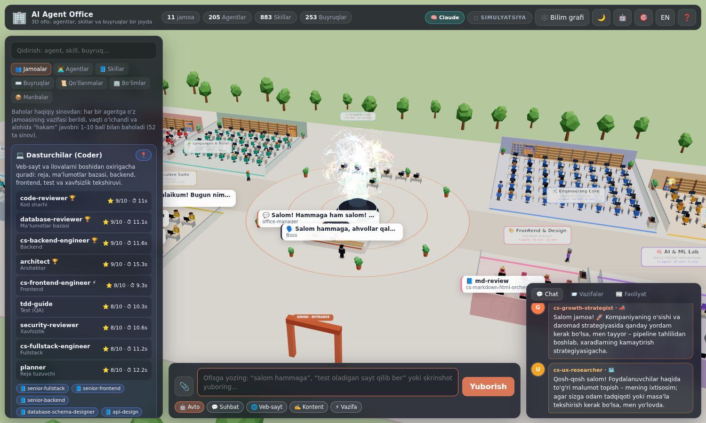 | 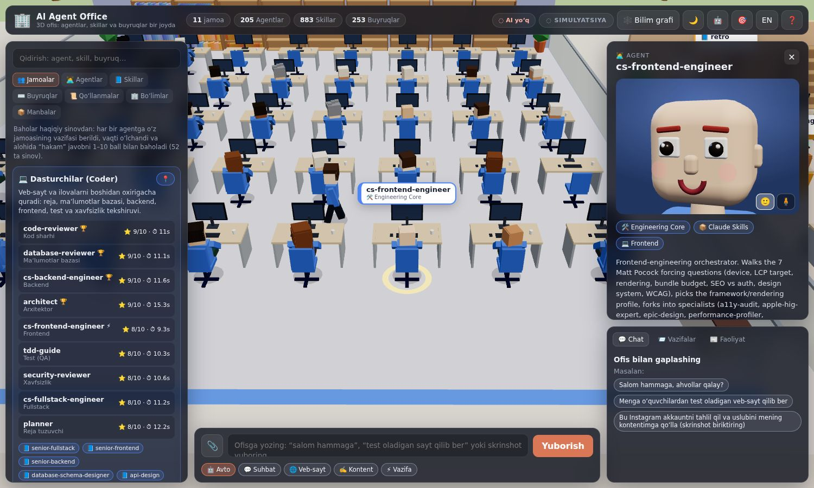 |
| 🌐 **“O‘quvchilardan test oladigan veb-sayt qilib ber”** — Coder jamoasi qurgan sayt ofisda darhol ochiladi | ✅ O‘sha sayt ishlaydi: kod `DEMO1` → ism → test → natija va javoblar tahlili |
| 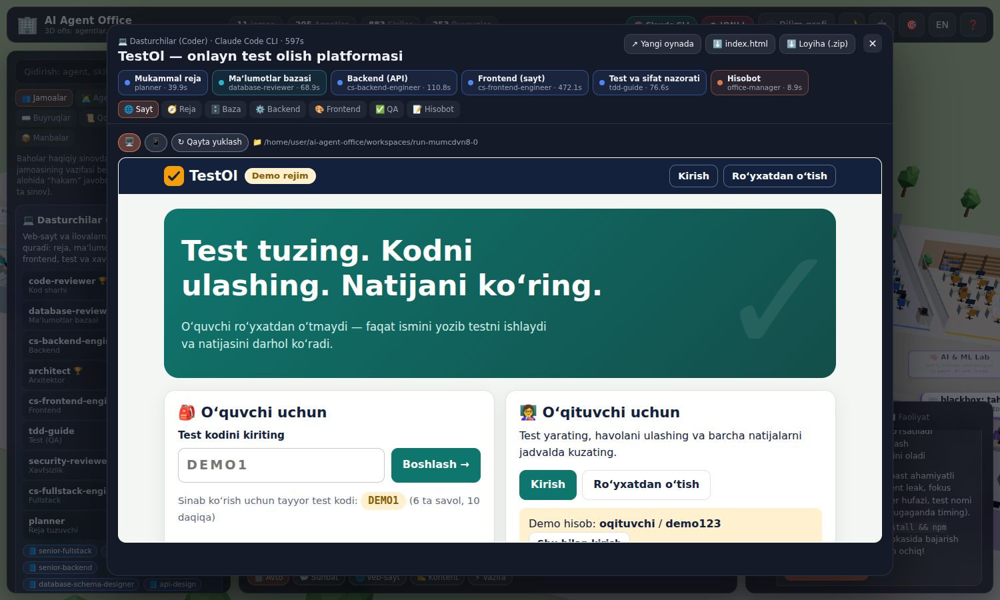 | 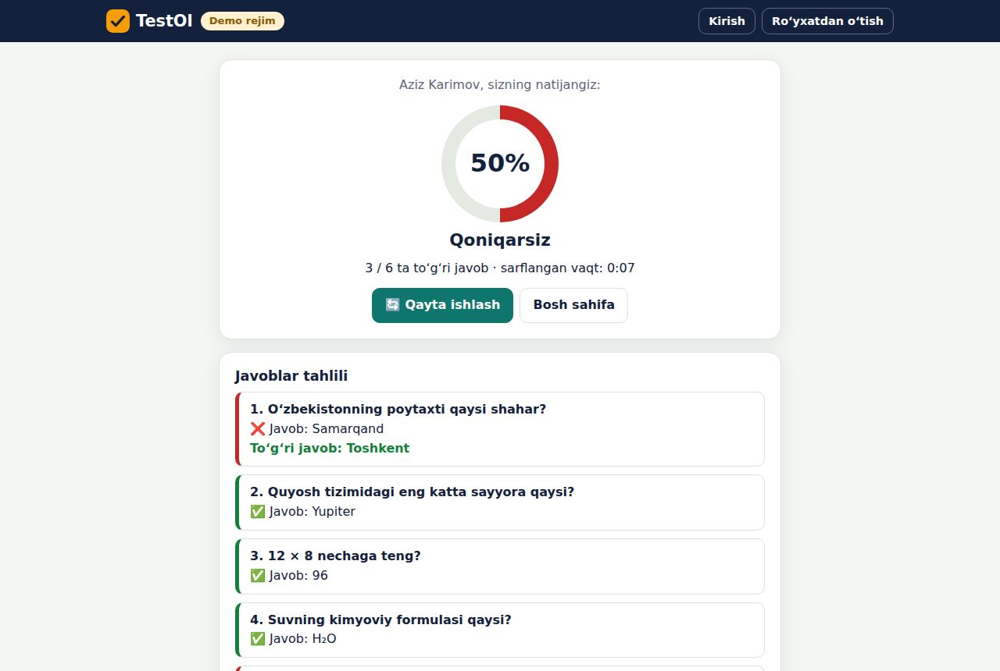 |
| ✍️ **Instagram skrinshoti + “uslubini mening kontentimga qo‘lla”** — tahlil | ✍️ Tayyor postlar (matematika repetitori uchun) |
| 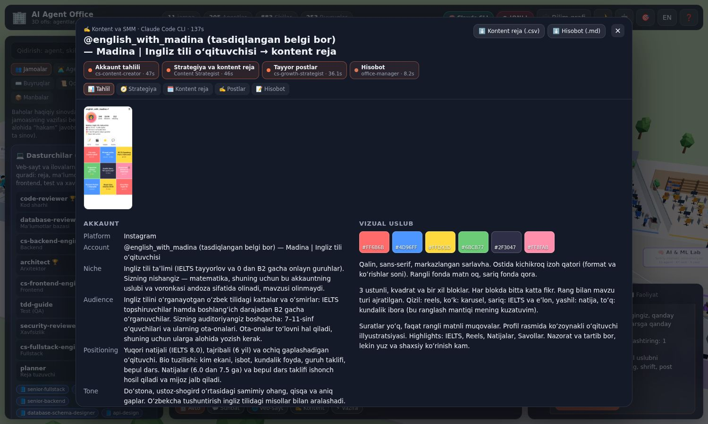 | 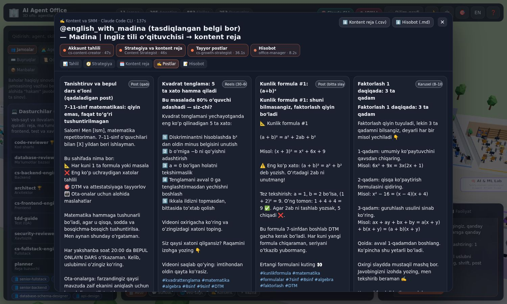 |
| ⚡ Boshqa vazifa: “narx strategiyasi tuz” → Biznes jamoasi (reja → bajarish → tekshiruv) | 📱 Telefonda |
| 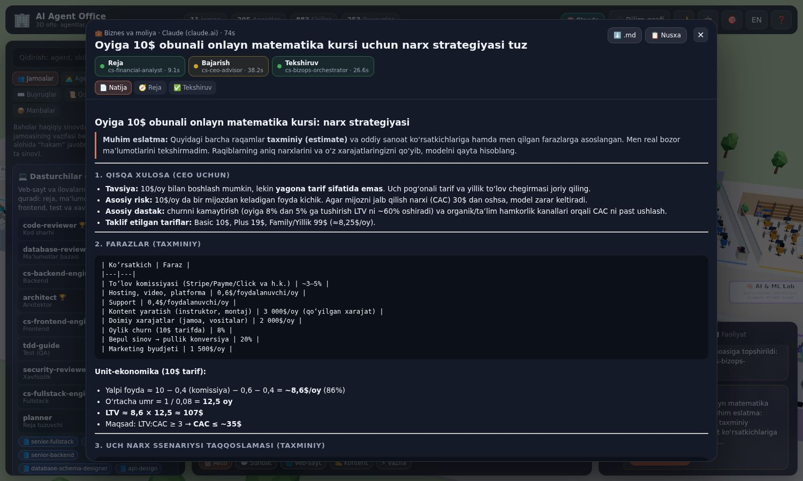 | 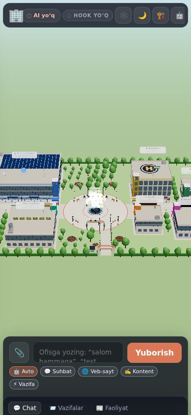 |
| 🌙 Tungi ofis va Graphify Core | 🕸️ Bilim grafi |
| 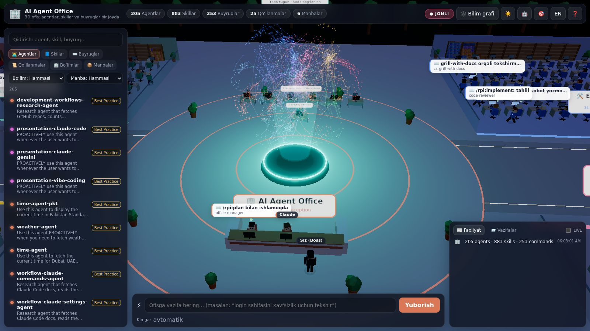 | 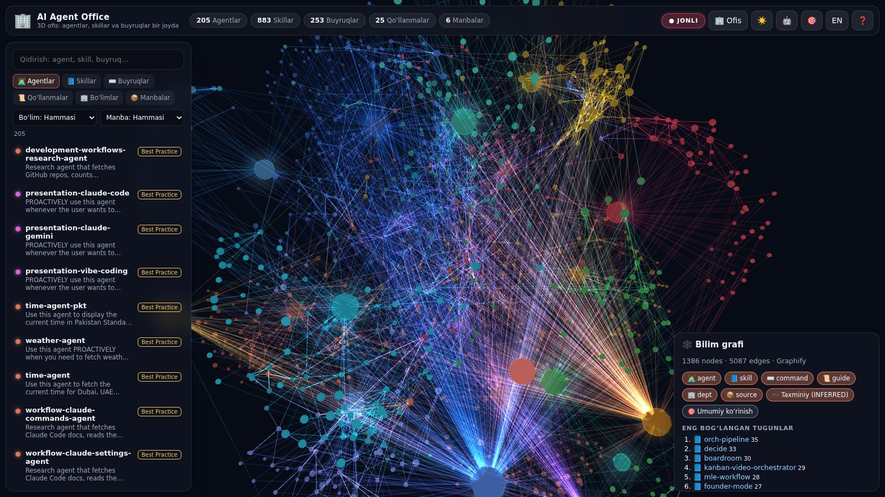 |

## Tez boshlash

Node.js **20.11+** kerak.

```bash
git clone https://github.com/bahriddin2005/ai-agent-office.git
cd ai-agent-office
npm install
npm run dev          # http://localhost:3333 — ofis + server (jonli rejim)
```

Yoki bitta port bilan: `npm start` → **http://localhost:3334** (build qiladi va server UI'ni ham beradi).

Server ishlamasa ham ofis simulyatsiya rejimida ishlaydi. **GitHub Pages:** repozitoriyda *Settings → Pages → Source: GitHub Actions* ni yoqing — `main` ga har push'da ofis avtomatik joylanadi (`.github/workflows/pages.yml`).

### Jonli rejim — Claude Code'ni ofisga ulash

```bash
npm run hooks:install                      # ~/.claude/settings.json ga (barcha loyihalar)
npm run hooks:install -- --project ../app  # faqat bitta loyihaga
npm run hooks:install -- --remove          # olib tashlash
```

Keyin ofisni ishga tushiring (`npm run dev`) va Claude Code'dan odatdagidek foydalaning. Yuqori o‘ng burchakda **● JONLI** belgisi yonadi.

### Agentlarga buyruq berish — AI qayerdan keladi

Pastdagi maydonga yozing, kerak bo‘lsa 📎 bilan skrinshot biriktiring (yoki rasmni joylashtiring/tashlang) va **Yuborish** ni bosing. Rejim avtomatik tanlanadi; xohlasangiz “💬 Suhbat / 🌐 Veb-sayt / ✍️ Kontent / ⚡ Vazifa” ni o‘zingiz tanlang. Yuqoridagi **🧠** belgisi agentlar qaysi AI bilan ishlayotganini ko‘rsatadi:

| Qayerda ochilgan | Agentlar nima bilan ishlaydi |
|---|---|
| `npm run dev` / `npm start` (kompyuteringizda) | Kompyuteringizdagi **Claude Code CLI** (`claude -p`, agentning o‘z ko‘rsatmalari system prompt sifatida). Yaratilgan saytlar `workspaces/<id>/` ga saqlanadi va alohida xavfsiz (sandbox) sahifada ochiladi. |
| claude.ai ichidagi artifact | **Claude hisobingiz** (`sample` imkoniyati). Birinchi so‘rovda ruxsat so‘raladi; skrinshotlar ham yuboriladi. |
| GitHub Pages yoki boshqa statik joy | AI yo‘q — ofis o‘z-o‘zidan “yashaydi”, buyruqlar bajarilmaydi va bu aniq aytiladi. |

Model darajalari: suhbat — tezkor model, reja/baza/backend/tahlil — standart, frontend — eng kuchli. `office.config.json` da `"models": {"quick": "haiku", "default": "sonnet", "complex": "opus"}` bilan o‘zgartirish mumkin.

### Jamoalar va sinov natijalari

`npm run benchmark` har bir jamoa aʼzosiga o‘z jamoasining vazifasini beradi (masalan, Coder: “test oladigan sayt uchun texnik reja”, Kontent: “7 kunlik Instagram reja”), vaqtini o‘lchaydi va alohida hakam-model javobni baholaydi. Oxirgi sinov (52 ta haqiqiy chaqiruv):

| Jamoa | 🏆 Eng yuqori baho | ⚡ Eng tez | Jamoa o‘rtachasi |
|---|---|---|---|
| 💻 Coder | database-reviewer, cs-backend-engineer, architect, code-reviewer — 9/10 | cs-frontend-engineer — 9.3 s | 8.4 |
| ✍️ Kontent | Content Strategist, cs-content-creator, cs-growth-strategist — 8/10 | cs-growth-strategist — 13.0 s | 7.7 |
| 🎨 Dizayn | cs-ux-researcher — 9/10 | presentation-vibe-coding — 12.8 s | 8.3 |
| 📣 Marketing | cs-demand-gen-specialist, Growth Marketer, seo-specialist — 8/10 | Growth Marketer — 13.2 s | 7.8 |
| 🔬 Tahlil | cs-deep-research, cs-product-analyst, graphify-librarian, cs-dossier — 7/10 | cs-product-analyst — 13.1 s | 6.8 |
| 💼 Biznes | cs-ceo-advisor, cs-financial-analyst — 9/10 | cs-bizops-orchestrator — 15.8 s | 8.4 |
| 🎓 Taʼlim | cs-deep-learning-tutor, cs-claude-coach — 8/10 | cs-deep-learning-tutor — 8.6 s | 7.7 |
| 🛡️ Xavfsizlik | security-reviewer — 8/10 | security-reviewer — 10.8 s | 6.5 |
| ☁️ DevOps | DevOps Engineer, network-architect, homelab-architect — 9/10 | build-error-resolver — 9.7 s | 8.8 |
| 🗺️ Mahsulot | cs-project-manager — 9/10 | cs-project-manager — 11.7 s | 8.0 |
| 🏢 Ofis | office-manager — 8/10 | hermes — 8.9 s | 6.0 |

Baholar model hakamining fikri — aniq o‘lchov emas, lekin qaysi agentni qaysi ishga qo‘yishni tanlashda yordam beradi. To‘liq javoblar `public/data/benchmarks.json` da va inspektorda (“🧪 Sinov”).

### Agentlarni “ishga olish”

```bash
npm run hire -- agent:ecc:code-reviewer                 # id bo‘yicha
npm run hire -- cs-backend-engineer vue-patterns        # nom bo‘yicha
npm run hire -- --dept security --type agent            # butun bo‘lim
npm run hire -- --source hermes --type skill --list     # faqat ko‘rish
npm run hire -- agent:ecc:planner --scope user          # ~/.claude ga
npm run hire -- agent:ecc:planner --project ../myapp    # boshqa loyihaga
```

Agent o‘zi e’lon qilgan skillari bilan birga o‘rnatiladi. `.sources/` mavjud bo‘lsa (`npm run sync`), skillar skript va reference fayllari bilan to‘liq nusxalanadi.

### Kutubxonani yangilash

```bash
npm run sync            # 6 ta repozitoriyni .sources/ ga klonlaydi yoki yangilaydi
npm run build:library   # library/, public/data/registry.json va graph.json ni qayta quradi
```

To‘liq Graphify grafini ham qurish mumkin: `uv tool install graphifyy && graphify install`, keyin Claude Code'da `/graphify library/`.

## Bo‘limlar

| Bo‘lim / Department | Agentlar | Skillar | Buyruqlar |
|---|---|---|---|
| 👔 **Executive Suite** — Rahbariyat | 21 | 62 | 2 |
| 🛠️ **Engineering Core** — Muhandislik markazi | 34 | 142 | 41 |
| 🧩 **Languages & Build** — Dasturlash tillari | 25 | 52 | 16 |
| 🎨 **Frontend & Design** — Frontend va dizayn | 7 | 65 | 18 |
| ☁️ **DevOps & Cloud** — DevOps va bulut | 7 | 37 | 1 |
| 🛡️ **Security & Compliance** — Xavfsizlik va muvofiqlik | 11 | 58 | 8 |
| 🧠 **AI & ML Lab** — Sunʼiy intellekt laboratoriyasi | 11 | 87 | 5 |
| 🔬 **Data & Research** — Maʼlumot va tadqiqot | 16 | 67 | 22 |
| 🗺️ **Product & Projects** — Mahsulot va loyihalar | 9 | 38 | 25 |
| 📣 **Marketing & Growth** — Marketing va o‘sish | 15 | 65 | 13 |
| 💼 **Sales, Finance & Ops** — Savdo, moliya va operatsiyalar | 5 | 56 | 18 |
| 🎬 **Creative Studio** — Ijodiy studiya | 3 | 43 | 0 |
| ⚡ **Productivity Hub** — Samaradorlik markazi | 12 | 66 | 21 |
| 🎓 **Claude Academy** — Claude akademiyasi | 29 | 45 | 63 |

Markaziy atriumda: **Claude** (bosh agent, qabulxonada), **office-manager** (Claude-Office'dan), **Siz (Boss)**, **graphify-librarian** va Graphify Core gologrammasi; mehmon agentlar uchun stollar.

## Manbalar

| Manba / Source | Litsenziya | Agentlar | Skillar | Buyruqlar | Qo‘llanmalar | Ofisdagi roli |
|---|---|---|---|---|---|---|
| [Claude Code Best Practice](https://github.com/shanraisshan/claude-code-best-practice) | MIT | 20 | 6 | 14 | 20 | Claude akademiyasi: best-practice, workflow, namuna agentlar |
| [Claude Skills](https://github.com/alirezarezvani/claude-skills) | MIT | 109 | 373 | 142 | 1 | Eng katta skill va persona kutubxonasi: muhandislik, mahsulot, marketing, C-level, compliance, moliya |
| [Claude Office](https://github.com/W17ant/Claude-Office) | MIT | 1 | 0 | 0 | 1 | Asl g‘oya: Claude Code hook → server → jonli ofis; office-manager persona |
| [Graphify](https://github.com/Graphify-Labs/graphify) | Apache-2.0 | 1 | 1 | 0 | 1 | Hamma narsani bitta bilim grafiga jamlash; graphify-librarian |
| [Hermes Agent](https://github.com/NousResearch/hermes-agent) | MIT | 1 | 211 | 0 | 1 | O‘z-o‘zini yaxshilaydigan agent va katta skill katalogi |
| [ECC](https://github.com/affaan-m/ECC) | MIT | 73 | 292 | 97 | 1 | Til bo‘yicha reviewerlar, build resolverlar, buyruqlar va yuzlab skillar |

Har bir fayl o‘z muallifi va litsenziyasini saqlaydi — qarang: [THIRD_PARTY_NOTICES.md](THIRD_PARTY_NOTICES.md) va `library/LICENSES/`.

## Qanday ishlaydi

```
Claude Code ──hook (office-hook.mjs)──▶ server :3334 ──WebSocket──▶ 3D ofis (Three.js)
                                           │  ▲
                            claude -p ◀────┘  └── vazifa / ishga olish (UI)
                                           │
                     library/ + registry.json + graph.json  ◀── build-library.mjs ◀── .sources/ (6 repo)
```

| Papka | Mazmuni |
|---|---|
| `src/world/` | Sahna: reja (`layout.ts`), mebel va javonlar (`office.ts`), instanced odamlar (`people.ts`), effektlar, yorliqlar |
| `src/sim/` | Agentlar holat mashinasi (`actors.ts`) va rejissyor: avto-hayot + jonli hodisalar (`director.ts`) |
| `src/ui/` | Panellar (`hud.ts`), bilim grafi (`graphView.ts`), markdown |
| `src/router.ts` | Vazifani eng mos agentga yo‘naltirish (TF‑IDF, o‘zbekcha sinonimlar bilan) |
| `server/` | Express + WebSocket: hooklar, vazifalar (`dispatch.mjs`), ishga olish |
| `scripts/` | `sync-sources`, `build-library` (katalog + graf + 3D joylashuv), `hire`, `install-hooks` |
| `hooks/office-hook.mjs` | Claude Code hook → ofis serveri |
| `library/` | Hamma agent, skill, buyruq va qo‘llanmalar bitta joyda |

### URL parametrlari

`?night` — tungi rejim · `?speed=3` — simulyatsiyani tezlashtirish · `?nobloom` — kuchsiz kompyuterlar uchun · `?offline` — serverga ulanmaslik.

## Xavfsizlik

- Server faqat `127.0.0.1` da tinglaydi; `Host` va `Origin` sarlavhalari tekshiriladi (DNS rebinding va boshqa saytlardan so‘rovlar bloklanadi).
- Hooklar va UI `~/.ai-agent-office/token` (0600) dagi token bilan autentifikatsiya qilinadi.
- Vazifa bajaruvchi agentlar standart holatda faqat o‘qiy oladi.

---

## 🇬🇧 English

**A 3D office where Claude Code agents, skills and commands live and work.** Everything from six open-source repos — [claude-code-best-practice](https://github.com/shanraisshan/claude-code-best-practice), [claude-skills](https://github.com/alirezarezvani/claude-skills), [Claude-Office](https://github.com/W17ant/Claude-Office), [graphify](https://github.com/Graphify-Labs/graphify), [hermes-agent](https://github.com/NousResearch/hermes-agent) and [ECC](https://github.com/affaan-m/ECC) — is gathered into `library/`, linked into a Graphify-style knowledge graph and rendered as a living Three.js office.

- **205 agents** sit at desks in **14 departments**; **883 skills** and **253 commands** are books on each department's shelves.
- **Ambient life:** agents fetch skill books, work, consult colleagues they are linked to in the graph, grab coffee and query the central **Graphify Core**.
- **Live mode:** `npm run hooks:install` wires Claude Code hooks to the office. Your prompts, Claude's tool calls, subagents (matched to their desks, or arriving as visitors) and skills (glowing books) show up in real time.
- **Talk and give work (English or Uzbek):** “hi everyone” gets in-character replies from several agents; “build me a quiz website” sends the **Coder team** through plan → SQLite database → Express backend → complete frontend → QA (and a fix pass) → report, then opens the finished site with its plan, code and a .zip; screenshots of an Instagram/Telegram account plus “analyse and apply the style to my content” sends the **Content team** through analysis → strategy and 14-day plan → 5 ready posts. Any other task goes to the best team: the lead plans, a specialist delivers, a colleague reviews.
- **Real agents:** every step is a real call with that agent's own instructions — through the Claude Code CLI when the local server runs, or through the viewer's own Claude when the office is opened in claude.ai.
- **Teams and a real benchmark:** 11 task teams; `npm run benchmark` gave every member its team's task, timed it and had a judge model score it (52 runs). The Teams tab marks 🏆 best and ⚡ fastest agents.
- **Portraits:** click anyone for a rotatable 3D portrait with a full face and body, hair style and a department accessory.
- **Hire:** install any agent/skill/command into `.claude/` from the inspector or with `npm run hire -- <id>`.
- **Knowledge graph:** 1,386 nodes / 5,087 edges with EXTRACTED vs INFERRED edges, communities by department and "god nodes".

```bash
npm install
npm run dev              # http://localhost:3333
npm start                # build + serve on http://localhost:3334
npm run hooks:install    # connect Claude Code (live mode)
npm run hire -- --list --type agent
npm run sync && npm run build:library   # refresh from upstream
```

Office code is MIT. Library files keep their original licenses (MIT, and Apache-2.0 for Graphify) — see [THIRD_PARTY_NOTICES.md](THIRD_PARTY_NOTICES.md).
